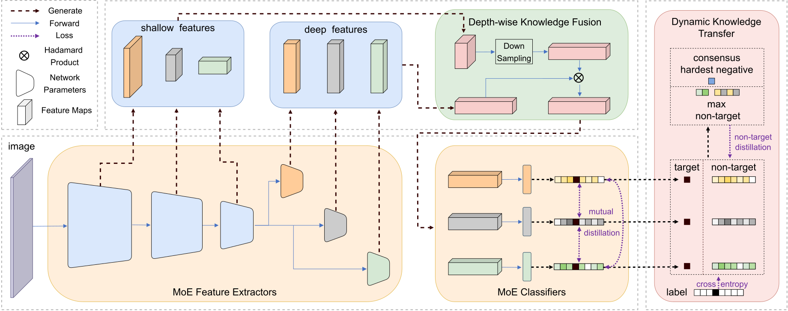

## SHIKE
**Long-Tailed Visual Recognition via Self-Heterogeneous Integration with Knowledge Excavation**

**Authors**: Yan Jin, [Mengke Li](https://github.com/Keke921), [Yang Lu*](https://jasonyanglu.github.io), [Yiu-ming Cheung](http://www.comp.hkbu.edu.hk/~ymc/), [Hanzi Wang](https://pami.xmu.edu.cn/hanzi_cn/)



This is the repository of the CVPR 2023 paper: "Long-Tailed Visual Recognition via Self-Heterogeneous Integration with Knowledge Excavation." We find that deep neural networks have different preferences towards the long-tailed distribution according to the depth. SHIKE is designed as a Mixture of Experts (MoE) method, which fuses  features of different depths and enables transfer among experts,  boosting the performance effectively in long-tailed visual recognition. 

#### Requirements
```
python  3.7.7 or above
torch   1.11.0 or above
```
### Reproducibility
Using the requirements file in this repo to create a virtual env.
Reset the seed to 0 (line 49 in cifarTrain.py) and you may get the ideal result.

### Implementation for all datasets is still under reoganizing...
stay tuned for it～

### Acknowledgement
Data augmentation in SHIKE mainly follows [BalancedMetaSoftmax](https://github.com/jiawei-ren/BalancedMetaSoftmax-Classification) and [PaCo](https://github.com/dvlab-research/Parametric-Contrastive-Learning).


### You May Find Our Additional Works of Interest

* [CVPR'22] Long-tailed visual recognition via Gaussian clouded logit adjustment [[paper](https://openaccess.thecvf.com/content/CVPR2022/papers/Li_Long-Tailed_Visual_Recognition_via_Gaussian_Clouded_Logit_Adjustment_CVPR_2022_paper.pdf)] [[code](https://github.com/Keke921/GCLLoss)]

* [TPAMI'23] Key point sensitive loss for long-tailed visual recognition [[paper](https://drive.google.com/file/d/1gOJDHBJ_M7RmU6Iw2p6uXIyo8pNgVMrv/view?pli=1)] [[code](https://github.com/Keke921/KPSLoss)]

* [AAAI'24] Feature Fusion from Head to Tail for Long-Tailed Visual Recognition [[paper](https://arxiv.org/pdf/2306.06963)] [[code](https://github.com/Keke921/H2T)]

* [NeurIPS'24] Improving Visual Prompt Tuning by Gaussian Neighborhood Minimization for Long-Tailed Visual Recognition [[paper](https://arxiv.org/pdf/2410.21042)] [[code](https://github.com/Keke921/GNM-PT)]

* [TAI'24] Adjusting logit in Gaussian form for long-tailed visual recognition [[paper](https://arxiv.org/pdf/2305.10648)] [[code](https://github.com/Keke921/GCLLoss)]


## Misc

If you find our paper and repo useful, please cite our paper:

```bibtex
@InProceedings{Jin_2023_CVPR,
    author    = {Jin, Yan and Li, Mengke and Lu, Yang and Cheung, Yiu-ming and Wang, Hanzi},
    title     = {Long-Tailed Visual Recognition via Self-Heterogeneous Integration With Knowledge Excavation},
    booktitle = {Proceedings of the IEEE/CVF Conference on Computer Vision and Pattern Recognition (CVPR)},
    month     = {June},
    year      = {2023},
    pages     = {23695-23704}
}

